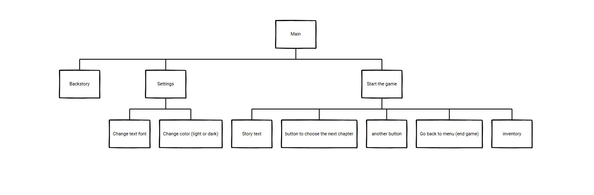
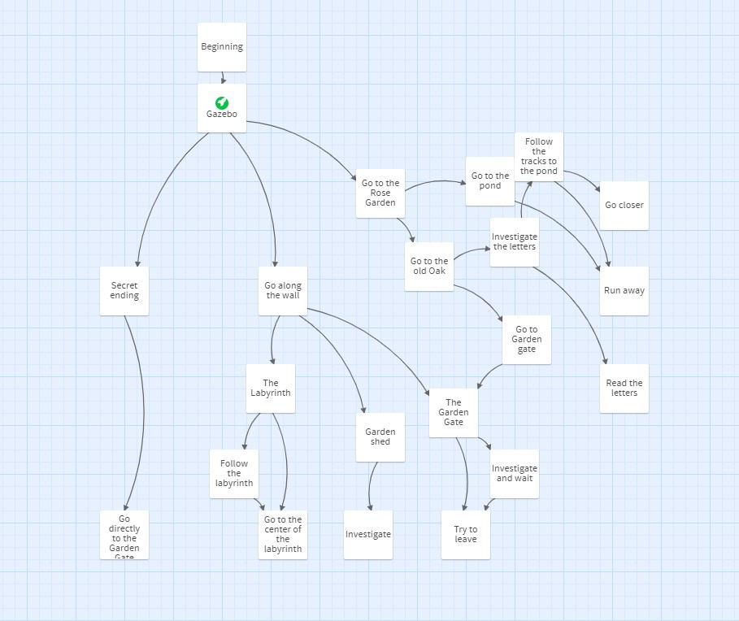
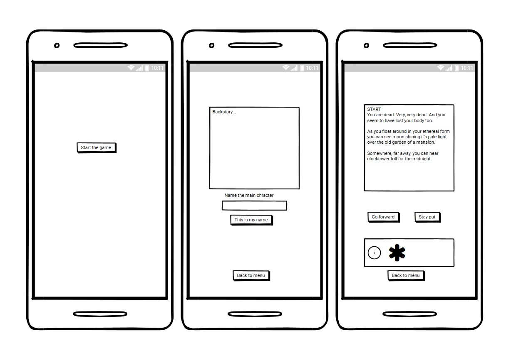
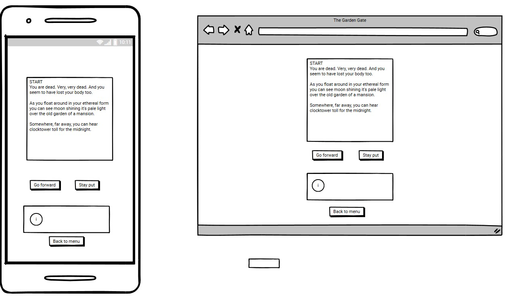
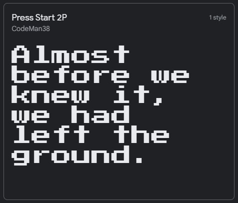

# The Garden Gate - Interactive story

## Strategy
This game is Choose your own adventure- type of story.  Player can choose to play only one story line or, if replayed, unlock the final story. This game is for fun, but has some darkes themes and is not suitable for young players. 

## Scope
Since the project can't be too large I choose to make a limited amount of story lines and make the game re-playable. To Make this sort of text-heavy game I have been advised to make use Of JSon, and will add most of the text on a separate file to be called on.

### User goals:
What is their goal? What problem does this product or feature solve for them?
-It's a game, and hopefully user is going to have some fun playing it.

#### User Stories:
- User can start the game.
- User can give a name for the character.
- User can read the story part, and choose from options what to do next.
- User can end the game when they want.
- User can choose to replay.
- User can see items they have collected.

## Structure

### Structure of the site

### Structure of the game

## Skeleton:

## Surface:
Style: 
I wanted this small game to have old school Nintendo gameboy feeling, 
mixed with "choose your own adventure"-type of text adventure mixed with gothic romance horror story.
The style would be visible in the background, and the "game screen" would be mostly white.
Some pictures that might appear during game are pixel art.

Colors: Black, white and gray tones. Nothing fancy here.

Fonts: Press Start 2P from Google Fonts
- 

## TESTING
User stories:
- User can choose to start the game.
- User can give a name for the character.
- User can read the story part, and choose from options what to do next.
- User can see their previous decision.
- User can end the game when they want.
- User can choose to replay.
- User can see items they have collected.

### Bugs and other issues:
- Had problems with start button function that was purely JS. Changed the start-button from being JS to be in HTML instead.
- Ended up doing same with thing with option buttons.
- 29/6: Problem: How to change text of both option buttons at the same time as well as the story text. Trying to have all three to read the pageNumber, but something isn't connecting right. After meeting with mentor I'm going to change code so that all three changes are under one function, since currently they are seperate.
- "forEach is not a function" Error. Fixed: added Array.from(document.querySelectorAll('')) to make buttons an array.
- All the different functions that use pageNumber needs to be updated at the same time. 
- Option buttons are hopping over options. I suspect that they receive the same command too many times. Fixed? The function is right but the texts are wrong. Problem was with the order of option buttons.
- Added replay button, but it doesnt refresh the page number. Buttons seems to be adding new page number to previous one they used. This seems to be part of the previous problem with pagenumber updating.

### DEPLOYMENT
Site was deployed to Github Pages.
From Github, I chose the current project Lairhaven and Settings.
On the leftside of the page there is Pages.
Choose the Main branch
Site will be published.
This site is published at: 

### Inspiration:
Interactive fiction (https://en.wikipedia.org/wiki/Interactive_fiction)
Text adventures
Choose your own adventure-books (https://en.wikipedia.org/wiki/Choose_Your_Own_Adventure)
Zero Escape- game series (https://en.wikipedia.org/wiki/Zero_Escape)

### CREDITS
People:
Media:
Codes from other sources:
Other useful pages I used about JSON:
- https://www.digitalocean.com/community/tutorials/how-to-work-with-json-in-javascript
- https://developer.mozilla.org/en-US/docs/Learn/JavaScript/Objects/JSON
- https://www.delftstack.com/howto/javascript/load-json-file-in-javascript/

https://twinery.org/

## Thank you for reading!