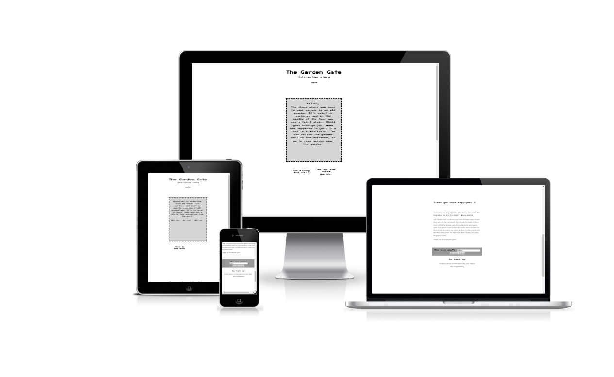
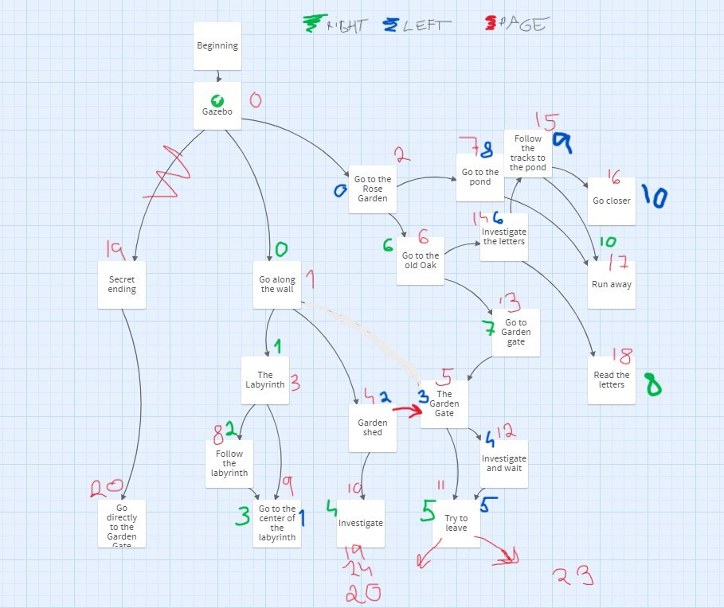
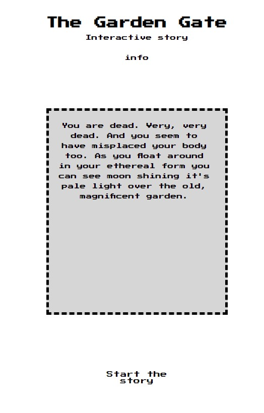
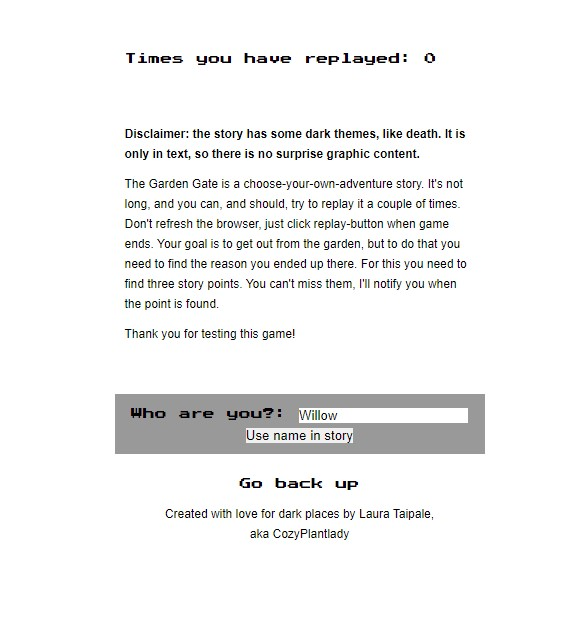
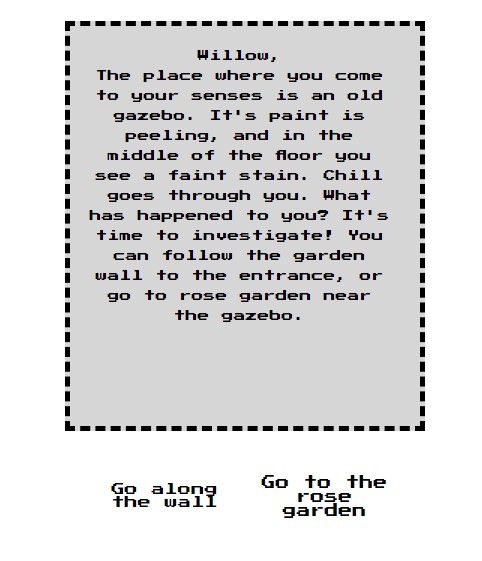
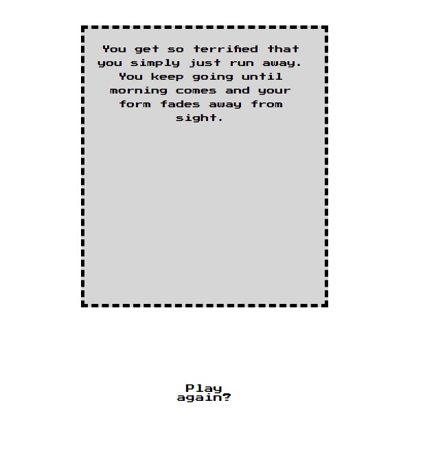
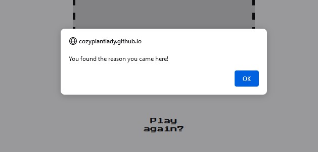
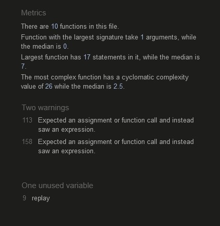

# The Garden Gate - Interactive story

In this README-file I'm using both the words "game" and "story" to talk about same project.
The Garden Gate is original work written by creator.

## Strategy
This game is Choose your own adventure- type of story. User can choose to play only one story line or, if replayed, unlock the final story. This game is for fun, but has some darker themes (death) and hence is not suitable for younger audience. 

## Scope
Since the project can't be too large I choose to make a limited amount of story lines and make the game re-playable. To make this sort of text-heavy game I have been advised to make use Of JSon, but didn´t have perfect time to get comfortable with it.

### User goals:
What is their goal? What problem does this product or feature solve for them?
-It's a game, and hopefully user is going to have some fun playing it.

#### User Stories:
- User can start the game.
- User can give a name for the character.
- User can read the story part, and choose from options what to do next.
- User can get more information about the game.
- User can end the game when they want.
- User can choose to replay.

## Structure

### Structure of the site
Original plan for the site

Before the project started I had a clear image on what the game should look like, but since the amount of time is limited it was most important to concentrate to make a working game before adding any extra features. Because of this the first features are: The story box that shows the text, and two buttons to choose and change the page. I also added "start" button that changes to a "replay" button.

### Structure of the game

#### Before

#### After

I was very confident with how the story needs to go, but once I started to code I faced some limitations. Most importantly, the longer text sections needed to be in two pages, and final ending needed to be triggered right way. In all honesty, this makes the flow of the code confusing and caused some unnecessary bugs. However, I decided to go with it since time was limited. In the future, if I'm doing similar project, I know to plan ahead and set a chracter limit for a page before hand.

## Skeleton:
### Original plans

### Final product
#### Main

In the main part of the screen we have
- Header, that has the name of the page.
- By clicking info, page scrolls to the button where info text is. 
- Info-text changes color and size when user hovers mouse over it, to indicate it is clickable.
- Story box, where the story will be shown
- Start button, that starts the game

#### Replay, Info and Footer

- Replay counter shows the amount of times user has replayed the game without refreshing.
- Disclaimer and other info for the user to see. Info button from top of the screen connects here.
- Name option: Player can give a name they want that will be used in the story.
- Go back up: scrolls back to the top of the page.
- Footer text has name of the creator

#### During the game

When game is started it shows two option buttons. Sometimes only one option is visible.

#### Replay

When the story line has come to an end user can choose to replay. Replay adds to a replay counter (No other function) and it's inmpossible to get the final ending without replaying.

When special story point is found user gets an alert.

## Surface:
Style: 
I wanted this small game to have old school Nintendo gameboy feeling, 
mixed with "choose your own adventure"-type of text adventure mixed with gothic romance horror story.
The style would be visible in the background, and the "game screen" would be mostly white.
- For the sake of hiding the buttons when there is no text option available the chosen border style is "hidden". This is not the best option when thinking accessability, but on my current skill set it was the way I chose to do things.

Colors: Black, white and gray tones. Nothing fancy here.

Fonts: Press Start 2P from Google Fonts

As a small touch I added favicon icon.

![][assets/images/readme-faviconflower.jpeg "")

## TESTING

### User Stories:

#### User can start the game: 
- Click the "Start the story" button in the main page

#### User can give a name for the character.
- User can write the name they want to use to the name field, and submit it. *This feature is currntly replaced by default name, Willow*

#### User can read the story part, and choose from options what to do next.
- When game is started, user can see the story page and two (or one) option buttons under it. User can click one to go forward in the story.

#### User can get more information about the game.
- Click "info", or scroll down the page to come to info section.

#### User can see their previous decision.
- *This feature is removed.*

#### User can end the game when they want.
- *This feature is removed. Story is very short.*

#### User can choose to replay.
- After story line has ended, "Play again?" text appears. By clicking it user goes back to the beginning of the story. Each replay adds to the counter, and if user has found one or more of the three special endings those stay in memory. When all three endings are found the final ending is unlocked.

### Bugs and other issues:
- Had problems with start button function that was purely JS. Changed the start-button from being JS to be in HTML instead. *Fixed*
- Ended up doing same with thing with option buttons. *Fixed*
- 29/6: Problem: How to change text of both option buttons at the same time as well as the story text. Trying to have all three to read the pageNumber, but something isn't connecting right. After meeting with mentor I'm going to change code so that all three changes are under one function, since currently they are seperate. (Note: functions are under same function, and then in their seperate ones) *Fixed*
- "forEach is not a function" Error. Fixed: Added Array.from(document.querySelectorAll('')) to make buttons an array. *Fixed*
- All the different functions that use pageNumber needs to be updated at the same time. Solution: a function (pageCounter) that collects the number everytime. *Fixed*
- Option buttons are hopping over options. I suspect that they receive the same command too many times. Solution: The function is right but the texts are wrong. Problem was with the order of buttons options. *Fixed*
- Added replay button, but it doesnt refresh the page number. Buttons seems to be adding new page number to previous one they used. This seems to be part of the ongoing problem with pagenumber updating. *Fixed*
- 30/6: Bug that shows html span element instead of the page number value. Solution: The initial pageNumber value needs to be "0". *Fixed*
- On a second play round forward "start button" changes the text to "replay", but it changes right back to "start game" when clicked/ Update: Now it shows "Play again" from start. Solution: Give value of Zero in the start, and jump to startScreen on replays. *Fixed*
- Only the option button that gets clicked gets updated. Solved by adding both btn1 and btn1 receiving a new message when one of them is clicked. *Fixed*
- 1/7: When replayed, you have to click one extra time for screen to refresh (Text getting to page zero and option buttons to appear). Solution: Function theEnd had unnecessary event listener *Fixed*
- Replay counter shows Nan instead of a number. *Fixed*
- Quick reminder for myself to never name name just name *Fixed*
- As I got page number showing properly on it's own it felt unnecessary. I shall remove it. *Fixed*
- 2/7: Was going to add 3th option button, but decided not to. It would make code more complicated with little value to add. Changing story page order so that it doesnt matter *Fixed*
- 4/7: After adding some styling the option buttons wont disappear fully. Reason: Padding. Might have to ditch it all together. *Fixed*
- Some story pages are too long and text overflows. To fix this some longer pages go to two pages. I add these to last of the list. *Fixed*
- Depending of the button color and its's background color it may or may not be visible when having a empty a string of text. I want them to be invisible. *Fixed*
- As fun as it is to have a lot of text in the buttons, it's not functional. Let buttons have one size, and shorten the long texts. Update: This really makes it obvious that there is an empty box. To solve this I have removed background color of the button, but to give a visual que for the user the text gets bigger when user hovers mouse over it. *Fixed*
- 
- Value given for the name box appears in story pages, but can´t be given by user. Update: Not fixed. Game is currently reading a hidden value to show a name.
- Other known issues: buttons are functional even when hidden, so they can be clicked by accident or by on purpose. These is main problem when playing.
- Safari browser shows several story pages at once. No known fix.

### Testing with code validators
Tested with JSHint validator:

- First warning comes from replayCounter function, and it should turn array to a number, that function can use. 
- Second warning is coming from buttonOption array. This notices if it's left or right button that gets clicked, and moves forward to either btnOneText or btnTwoText accordingly. I didn't find any problem with this part of the code.

- Unused variable "replay" removed.

- Other small bugs, like forgotten colons, fixed.

Tested with W3C CSS-validator:
- Found bugs fixed.
- Validator gives a warning about .hidden class, since it has both white text and white background. However, this is the whole point.

Tested with W3C markup-validator:
- No mentionable issues

Validators I used:
JSHint https://jshint.com
W3C CSS-validator https://jigsaw.w3.org/css-validator/

### Possible features to add
- Choice to choose between dark and light color theme.
- Json to hold all the text options. This would make code a lot cleaner, but I didn't have enough time to throw myself in to it.
- Choice to choose another font for the text. Current font is a style choice, but another font would be eaiser to read.
- Pixel art pictures for some story points

### DEPLOYMENT
- Site was deployed to Github Pages.
- From Github, I chose the current project The Garden Gate and Settings.
- On the leftside of the page there is Pages.
- Choose the Main branch
- Site will be published.
- This site is published at: 

### Inspiration:
- Interactive fiction (https://en.wikipedia.org/wiki/Interactive_fiction)
- Text adventures
- Choose your own adventure-books (https://en.wikipedia.org/wiki/Choose_Your_Own_Adventure)
- Zero Escape- game series (https://en.wikipedia.org/wiki/Zero_Escape)

### CREDITS
- People:
- Media:
- Codes from other sources:

#### Other things I used while doing this page:

Twinery
- Choose your own story builder (used in this project only to visualize the road map)
https://twinery.org/

Balsamiq wireframes

Favicon converter
https://favicon.io/favicon-converter/

Pixel art page and tool
https://www.pixilart.com/

## Thank you for reading!